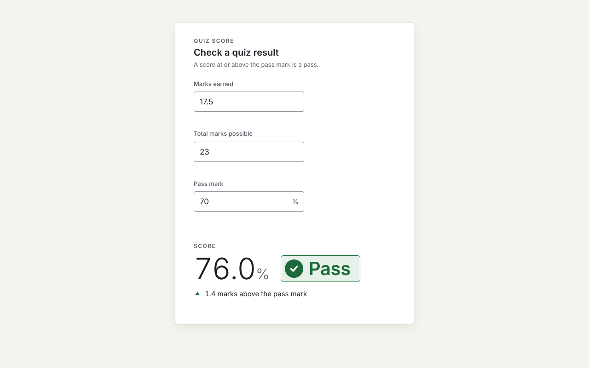

# Quiz score and pass-mark calculator — Sabee Khan

## What the app is and who it is for

A one-screen web calculator that turns raw quiz marks (for example 17.5 out of 23) into a percentage score, a clear Pass or Fail verdict against a pass mark, and how many marks the result is short of or above that pass mark. It is for two people on a compliance course: the **Learner**, who has had a quiz returned as raw marks and needs to know whether they passed and by how much before a resit deadline, and the **Instructor**, who marks short-answer assessments by hand and must record the same defensible percentage and verdict for every learner (see [app roles](docs/app-roles.md)). Mistyped or impossible entries, such as more marks earned than possible or a total of 0, get a plain message naming what to fix and no score.



## Why this calculator

Chosen by the product owner from three options (decision DEC-6; full comparison in the [product brief](docs/process/product-brief.md)):

- **Fits the company:** learners and instructors are KnowledgeCity's everyday users.
- **Roles that differ:** the Learner wants a verdict and the gap to the pass mark; the Instructor wants a consistent, defensible percentage.
- **Edge cases come from the domain:** 0 possible marks (division by zero), marks earned above marks possible, rounding at the pass boundary (69.96% must never look like a 70% pass).
- **Small and safe for 2–4 hours:** 3 inputs, 3 Must stories, no currency or locale formatting.
- **Fresh:** it does not repeat an earlier bill-splitter attempt in this repository's history.

## Prerequisites

- **Node.js 20 LTS.** `.nvmrc` says `20` (run `nvm use` if you use nvm); `package.json` requires `"node": ">=20"`. CI runs on Node 20.
- **npm**, which comes with Node.js.
- **Git**, to clone the repository.
- No accounts, API keys, backend or cloud services. The app has no runtime dependencies.

## Install and start

```bash
git clone https://github.com/Sabeekhann/Web-Calculator.git
cd Web-Calculator/sabee-khan-calculator
npm ci            # npm install also works
npm run dev
```

Open the URL Vite prints, normally <http://localhost:5173/>.

Production build:

```bash
npm run build     # type-check, then build into dist/
npm run preview   # serve dist/ at http://127.0.0.1:4173/
```

## Running the tests

**Unit tests (Vitest)**: 131 tests in `tests/unit/`, one file per story (S-1, S-2, S-3) plus the message catalogue.

```bash
npm test
```

**End-to-end tests (Playwright)**: 51 tests per engine, on Chromium, Firefox and WebKit, run against the production build (Playwright builds it and starts `vite preview` itself).

```bash
npx playwright install --with-deps    # one time: downloads the Playwright browsers
npm run test:e2e
```

`--with-deps` also installs the system libraries Firefox and WebKit need on Linux, so it may ask for an admin (sudo) password; this is the same step CI runs. On Windows and macOS, plain `npx playwright install` is enough.

| Spec file (`tests/e2e/`) | Tests | Covers |
|-----------|-------|--------|
| `shell.spec.ts` | 4 | Page title and heading, labelled inputs, idle state, no sideways scroll at 320 px |
| `S-1.spec.ts` | 8 | S-1 acceptance criteria: score and Pass/Fail verdict |
| `S-2.spec.ts` | 9 | S-2 acceptance criteria: marks short of or above the pass mark, plus no layout shift |
| `S-3.spec.ts` | 10 | S-3 acceptance criteria: error messages, plus no layout shift |
| `a11y.spec.ts` | 10 | axe scan for WCAG 2.2 AA in 5 states (idle, Pass, Fail, error, pass mark empty), light and dark |
| `edge.spec.ts` | 10 | Edge sweep: spaces, lone "." or "-", 400-digit input, pasted text, Enter key, reload, key-by-key typing, never NaN/Infinity/undefined/blank |

**CI:** [`.github/workflows/ci.yml`](https://github.com/Sabeekhann/Web-Calculator/blob/main/.github/workflows/ci.yml) runs on every push and pull request, on Node 20: `npm ci`, `npm audit`, unit tests, build, then the e2e suite on all three engines. Playwright never retries a failed test (`retries: 0`). No coverage tool is configured.

## Reviewer quick check

Run `npm run dev`, open the page, and try (the pass mark starts at 70):

1. Type **17.5** in Marks earned and **23** in Total marks possible. Expect **76.0%**, **Pass**, "1.4 marks above the pass mark", with no button to press. (S-1, S-2)
2. Change Marks earned to **15.5**. Expect **67.3%**, **Fail**, "0.6 marks short of the pass mark". (S-1, S-2)
3. Enter **17.49** of **25**. Expect **69.9%** and **Fail**, never "70.0%". Then **17.5** of **25**: **70.0%**, **Pass**, "Exactly on the pass mark". (S-1, S-2 boundary)
4. Enter **23.5** of **23**. Expect "Marks earned can't be more than the total marks possible." and no score. Change it to **17.5**: the message goes and 76.0% Pass returns. (S-1/S-2 error case)
5. Type **abc** in Marks earned and **0** in Total. Expect "Marks earned must be a number, like 17.5." and "Total marks possible must be more than 0." together, and "The score will appear once every entry is valid." (S-3)
6. Put back 17.5 of 23 and type **-5** in the pass mark. Expect "Pass mark can't be negative." and no score. (S-3)
7. Clear the pass mark. Expect 76.0% to stay, with "Enter a pass mark to see whether this is a pass or a fail." and no red message. (S-3)

## AI tool and model used

Claude Code (cloud session, launched from the desktop app), Claude Opus 5.5, with 7 subagents defined in `.claude/agents/` at the repo root (DEC-4).

How the product owner directed the work (rules in [CLAUDE.md](https://github.com/Sabeekhann/Web-Calculator/blob/main/CLAUDE.md), every decision in the [decision log](docs/process/decision-log.md)):

- **Gated stages:** nothing moved to the next stage until the PO approved it at a gate.
- **Documentation first:** roles → jobs → stories with acceptance criteria → design → plan → code.
- **Tests first, builder is not the checker:** the developer wrote failing tests from the acceptance criteria before the code; the qa-engineer, ux-ui-designer and release-auditor checked the work independently.
- **PO accepted every story** on a QA PASS, then checked the live app in real browsers before release (DEC-14 to DEC-18).

## Code changed by hand

None.

## Assumptions

Approved by the product owner (IDs match the [decision log](docs/process/decision-log.md)):

- **A-1** A learner passes when the score is at or above the pass mark.
- **A-2** The verdict uses the exact, unrounded score, never the displayed value.
- **A-3** The score is shown to 1 decimal place, rounded down (69.96% → "69.9%", 2/3 → "66.6%"), so a failing score never looks like the pass mark.
- **A-4** Marks earned and total marks possible accept up to 2 decimal places, with a dot as the decimal separator.
- **A-5** Total marks possible is more than 0 and at most 1,000,000.
- **A-6** The pass mark starts at 70, can be changed, and accepts 0 to 100 with up to 1 decimal place.
- **A-7** Results update as you type; there is no Calculate button.
- **A-8** Marks earned can't be more than total marks possible (no bonus marks).
- **A-9** The gap to the pass mark is shown in marks, not percentage points.
- **A-10** Marks needed = pass mark ÷ 100 × total. A shortfall is rounded up and a surplus rounded down to 2 decimal places; a surplus under 0.01 shows "Less than 0.01 marks above the pass mark"; equal shows "Exactly on the pass mark".
- **A-11** Gap numbers drop trailing zeros ("0.60" → "0.6") and use comma thousands separators ("699,999.99"); "mark" is singular only for exactly 1.
- **A-12** An empty field (or only spaces) never shows an error: the result area asks for the missing entries; with no pass mark the score still shows and the verdict area asks for a pass mark.
- **A-13** Accepted numbers: digits with at most one dot (".5" and "5." are fine), leading zeros, surrounding spaces ignored. Anything else ("abc", "17,5", "$17", "1.2.3", "1e400", "+5") gets that field's not-a-number message.
- **A-14** A minus sign before a number, including "-0", gets that field's can't-be-negative message.
- **A-15** Each field is checked in order (not a number → negative → too many decimals → range), then marks earned against total; each field shows at most one message, under itself.
- **A-16** While any field has an error, the result area says "The score will appear once every entry is valid." instead of a score.
- **A-17** "Next learner" (and Escape) would clear only marks earned and keep total and pass mark. This applies to S-4, which is not built.
- **A-18** A field holding only "." counts as empty, so no error flashes while typing ".5"; a lone "-" gets the can't-be-negative message.

## Known limitations / Not implemented

Story status is kept in [user-stories.md](docs/user-stories.md). S-1, S-2 and S-3 are Implemented.

- **S-4 Next learner in one step: Not implemented.** Cut when the time budget ran out (DEC-17), following the rule "cut Should stories first, never quality". Its button and Esc hint were taken out of the UI.
- **S-5 Copy the outcome as one line: Not implemented** (future story).
- **S-6 Marks needed to pass: Not implemented** (future story).
- Nothing is saved: no history, no export, and a reload clears the fields.
- One learner at a time; no batch or CSV import.
- Dot is the only decimal separator; no locale number formats (no "17,5", no thousands separators in input).
- Total marks possible is capped at 1,000,000.
- Uses the system font stack, so text looks slightly different on Windows, macOS and other systems.

## Browser support

Current Chrome, Edge, Firefox and Safari, on desktop and phone, from 320 px wide, in light and dark mode.

How this was checked:

- **Automated:** Playwright e2e on Chromium, Firefox and WebKit in GitHub Actions on every push (51 tests per engine). Firefox and WebKit run only in CI because the build container could not download those browsers (ADR-009 in the [technical design](docs/process/technical-design.md)); local runs in that container used Chromium.
- **Manual:** the product owner ran a 14-step checklist ([sprint-2 QA report](docs/process/qa-reports/sprint-2.md)) in real Chrome, Edge, Firefox and Safari and on a phone; all steps passed (DEC-18).

## Live URL

<https://sabeekhann.github.io/Web-Calculator/>

This is in addition to the local run, not instead of it. It is deployed from `main` by [`.github/workflows/pages.yml`](https://github.com/Sabeekhann/Web-Calculator/blob/main/.github/workflows/pages.yml).

## Docs index

Product documents:
- [App roles](docs/app-roles.md)
- [Jobs to be done](docs/jobs-to-be-done.md)
- [User stories with acceptance criteria and status](docs/user-stories.md)

Process documents (`docs/process/`):
- [Product brief](docs/process/product-brief.md)
- [UI design](docs/process/ui-design.md)
- [Technical design and ADRs](docs/process/technical-design.md)
- [Test plan](docs/process/test-plan.md)
- [Backlog](docs/process/backlog.md)
- [Sprint log](docs/process/sprint-log.md)
- [Decision log](docs/process/decision-log.md)
- [Delivery tracker](docs/process/delivery-tracker.md)
- [QA reports](docs/process/qa-reports/)

## Transcripts

[`transcripts/`](transcripts/) is for the session transcripts (`session-01.md`, …) exported by the product owner, plus the raw session logs. They are added at the final hand-in stage, after the build sessions end.
